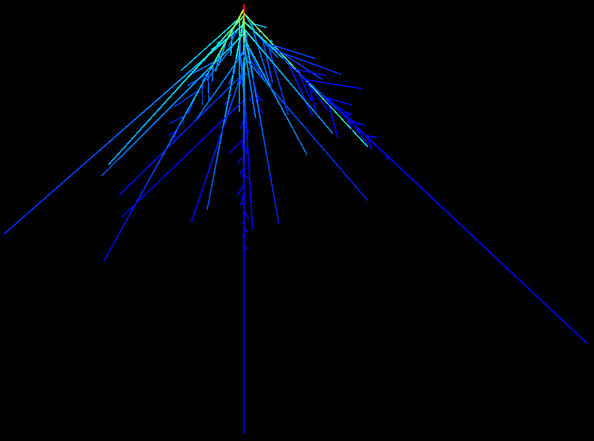

# HydroRoot

[](https://hydroroot.readthedocs.io/en/latest/?badge=latest)
[](https://github.com/openalea/hydroroot/actions/workflows/openalea_ci.yml)
[](https://www.python.org/downloads/)
[](https://anaconda.org/openalea3/openalea.hydroroot)
[](https://www.cecill.info/licences/Licence_CeCILL-C_V1-en.html)
[](https://mybinder.org/v2/gh/openalea/hydroroot/HEAD?urlpath=%2Fdoc%2Ftree%2Fexample%2Fnotebook_list.ipynb)

OpenAlea.HydroRoot is a hydraulic root architecture modelling and a root
architecture system generator package.

<figure>
    
    <figcaption>Heat map representation of the incoming local radial flows on an
arabidopsis root.</figcaption>
</figure>

### Description

The OpenAlea.HydroRoot package contains a root architecture simulation
model coupled with a water and solute transport solver. It contains a
pure hydraulic solver that is solved using resistance network analogy.
It also contains a water and solute transport solver that is more
complex and see the root as a continuous medium.

### Authors

> -   Christophe Pradal
> -   Yann Boursiac
> -   Mikael Lucas
> -   Fabrice Bauget
> -   Christophe Godin
> -   Christophe Maurel

### Institutes

CIRAD / INRAE / inria / CNRS

### Status

Python package

### License

CecILL-C

### Installation

#### for user
Creating a new conda environment with hydroroot and its dependencies installed
```bash
mamba create -n hydroroot -c openalea3 -c conda-forge openalea.hydroroot
```
In an existing conda environment:
```bash
mamba install -c openalea3 -c conda-forge openalea.hydroroot
```

#### for developer
```bash
mamba env create -f ./conda/environment.yml
```

#### Requirements

> -   openalea.mtg
> -   openalea.plantgl
> -   openalea.rsml
> -   openalea.widgets (for the notebook examples)
> -   matplotlib-base
> -   yaml
> -   pandas
> -   numpy
> -   scipy

#### Usage

See notebooks in example directory, they are listed [here](doc/example/notebook_list.ipynb) and can be played following [](https://mybinder.org/v2/gh/openalea/hydroroot/HEAD?urlpath=%2Fdoc%2Ftree%2Fexample%2Fnotebook_list.ipynb)


## Documentation

<https://hydroroot.rtfd.io>

## Citations

If you use Hydroroot for your research, please cite:

1.  Yann Boursiac, Christophe Pradal, Fabrice Bauget, Mikaël Lucas,
    Stathis Delivorias, Christophe Godin, Christophe Maurel, Phenotyping
    and modeling of root hydraulic architecture reveal critical
    determinants of axial water transport, Plant Physiology, Volume 190,
    Issue 2, October 2022, Pages 1289--1306,
    <https://doi.org/10.1093/plphys/kiac281>
2.  Fabrice Bauget, Virginia Protto, Christophe Pradal, Yann Boursiac,
    Christophe Maurel, A root functional--structural model allows
    assessment of the effects of water deficit on water and solute
    transport parameters, Journal of Experimental Botany, Volume 74,
    Issue 5, 13 March 2023, Pages 1594--1608,
    <https://doi.org/10.1093/jxb/erac471>

## Contributors

<a href="https://github.com/openalea/hydroroot/graphs/contributors">
  
</a>
