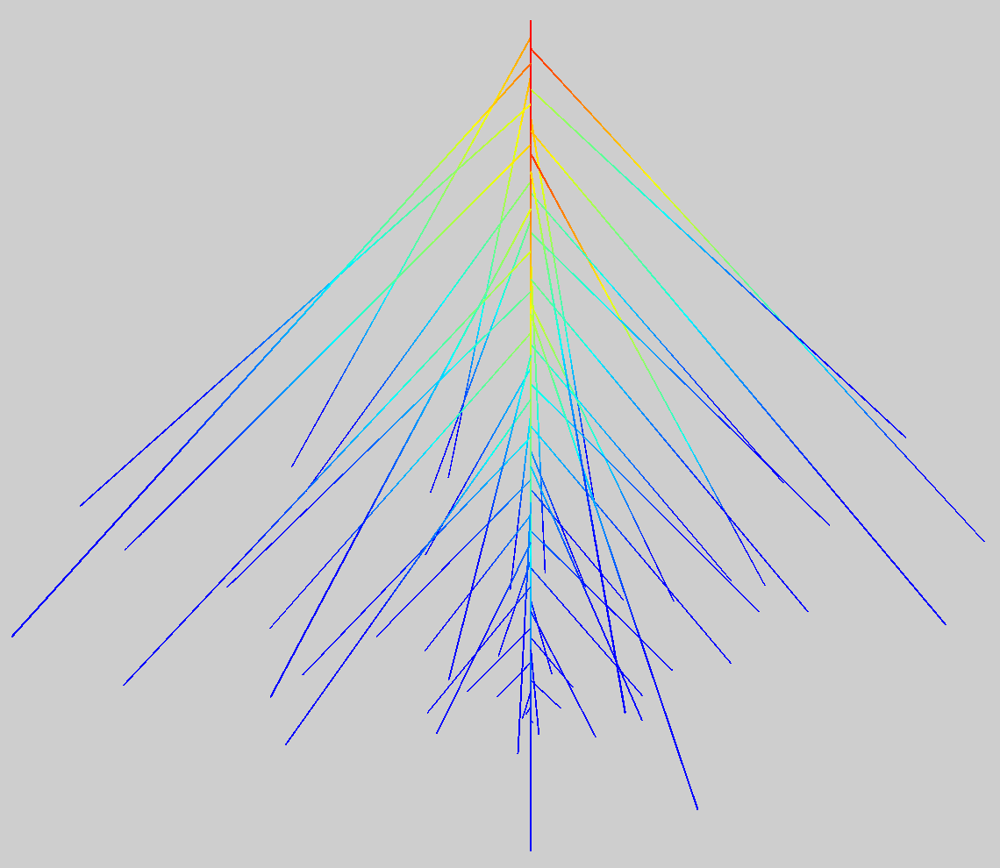
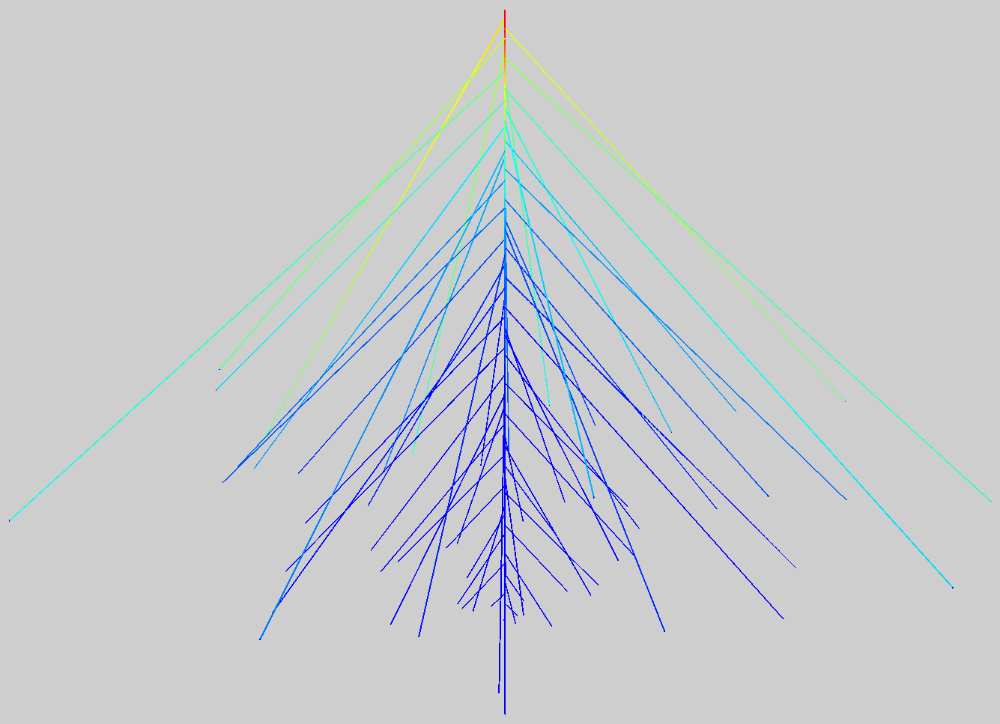

===============
Quick start
===============

In the two quick-start examples, roots are generated without biological relevance (standard lateral root length
can't be longer than the bearing axis remaining branching length ). Notebook examples give examples on realistic
architecture.

Generating a root
^^^^^^^^^^^^^^^^^

Build a root and display it in the PlantGL viewer.

.. code-block:: python

    from openalea.hydroroot.main import root_builder
    from openalea.hydroroot.display import plot
    g, primary_length, total_length, surface, seed = root_builder(order_max=1)
    plot(g)

Hydraulic simulation
^^^^^^^^^^^^^^^^^^^^

Build a root, run the hydraulic solver and display the eat map representation of the incoming
local radial flows on an arabidopsis root in the PlantGL viewer.

.. code-block:: python

    from openalea.hydroroot.main import hydroroot
    from openalea.hydroroot.display import plot
    K = ([0,0.2],[0.0,1.0e-2])
    k = ([0.0,0.2],[300.0,300.0])
    g, surface, volume, Keq, Jv_global = hydroroot(axial_conductivity_data = K, radial_conductivity_data=k, order_max = 1)
    plot(g, prop_cmap = 'j')

K (:math:`10^{-9}\ m^4.s^{-1}.MPa^{-1}`)  and k (:math:`10^{-9}\ m.s^{-1}.MPa^{-1}`) are the axial and radial conductances,
versus distance to tip (m), respectively.

Notebook examples
^^^^^^^^^^^^^^^^^

See examples in the :ref:`gallery-label` that illustrate some HydroRoot capabilities.

See also the jupyter notebook *boursiac2022.ipynb* in *example/Bourisac2022* that is aimed to run different simulations to
generate figures and tables of Bourisac et al. 2022 [boursiac2022]_.
